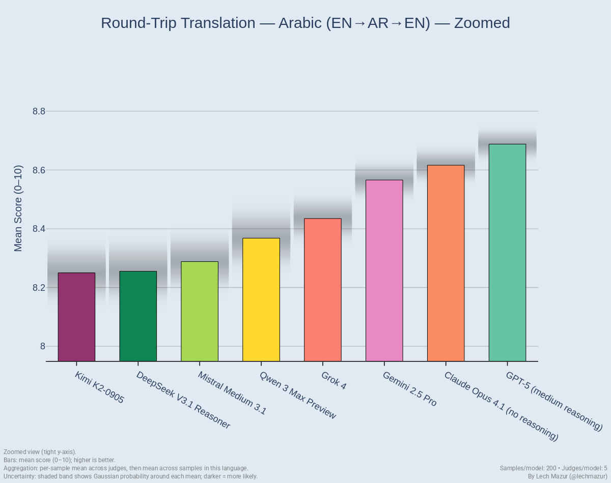
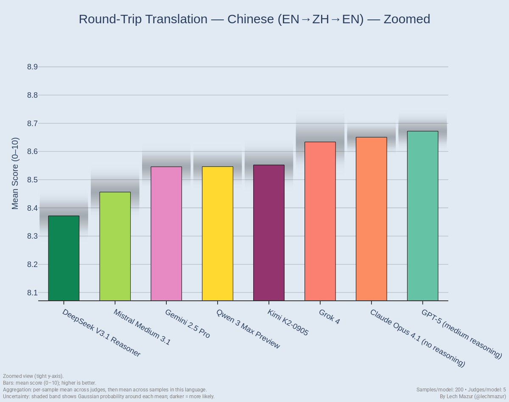
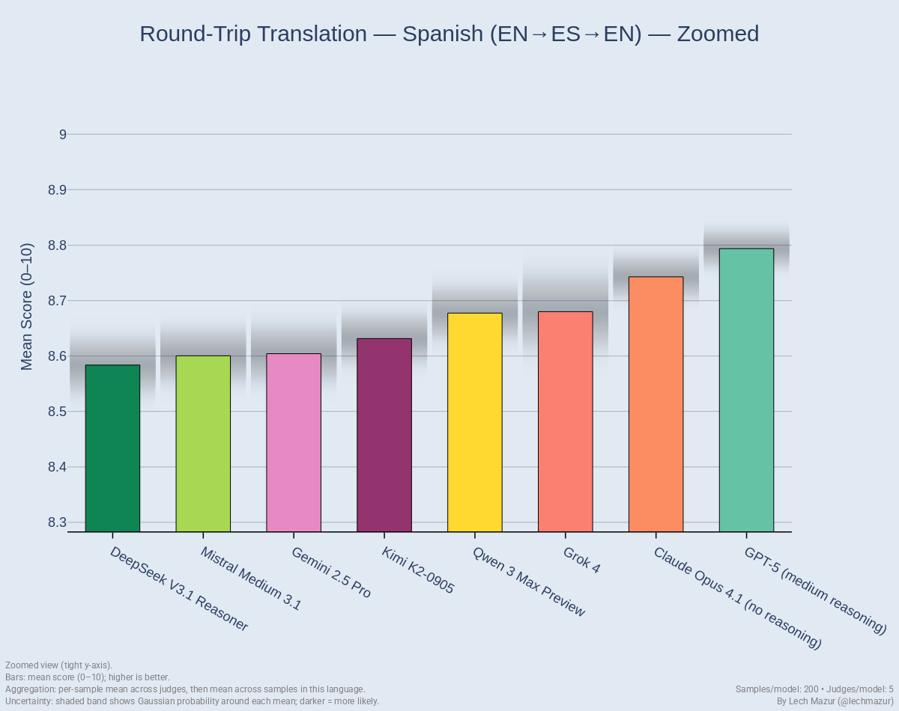
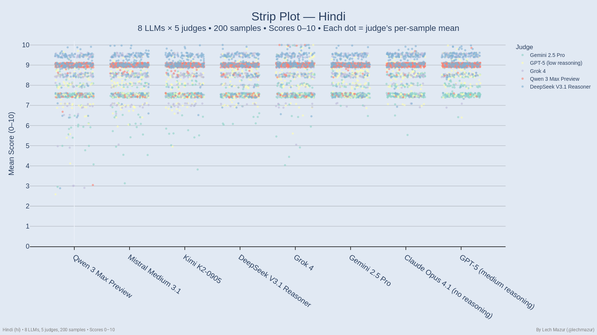
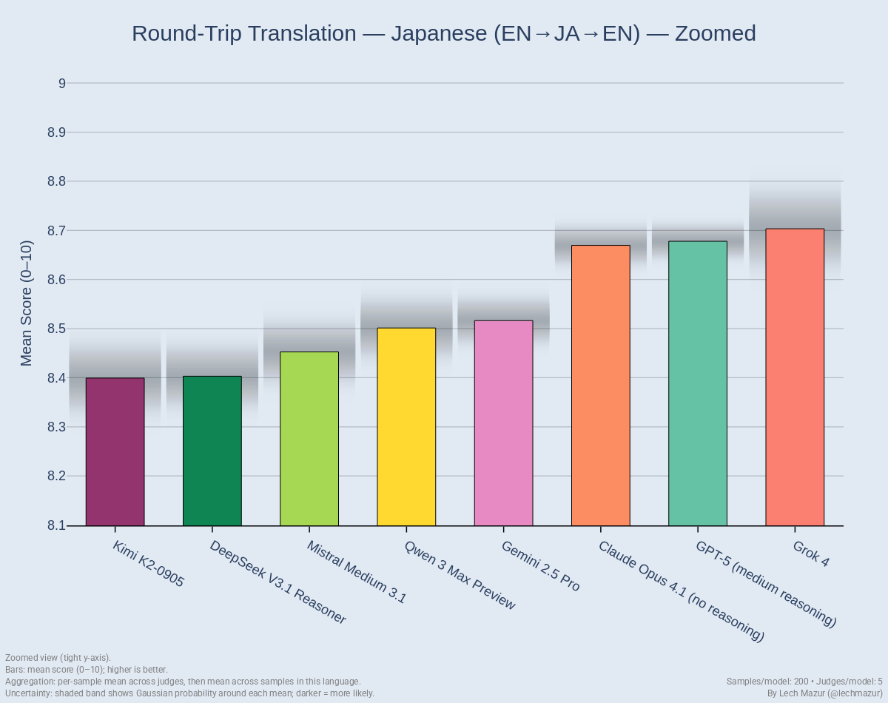
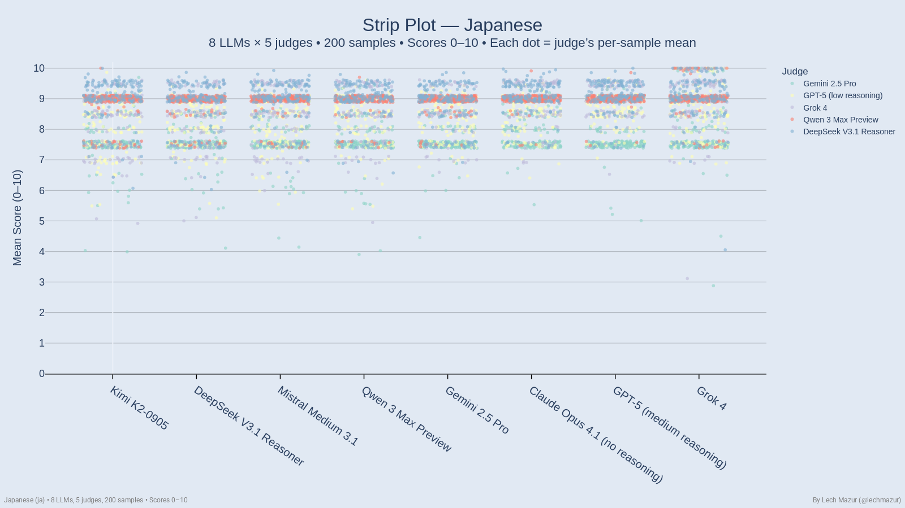
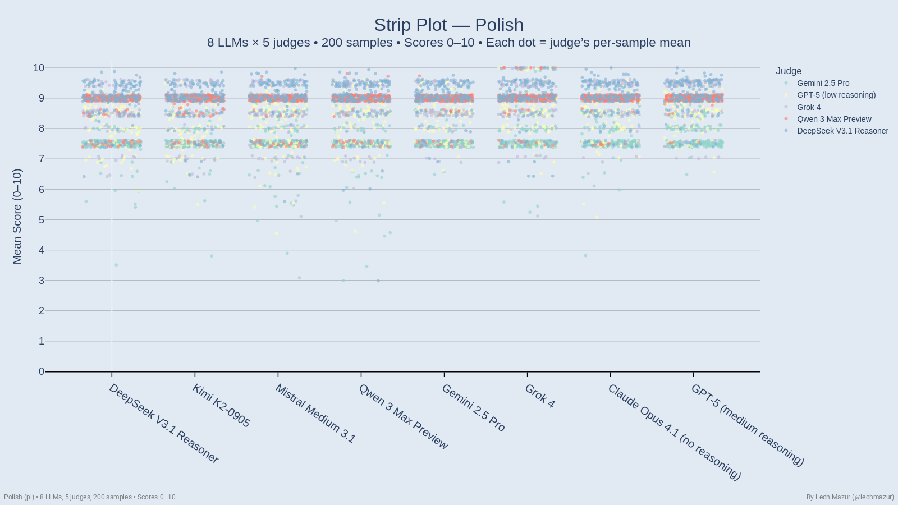
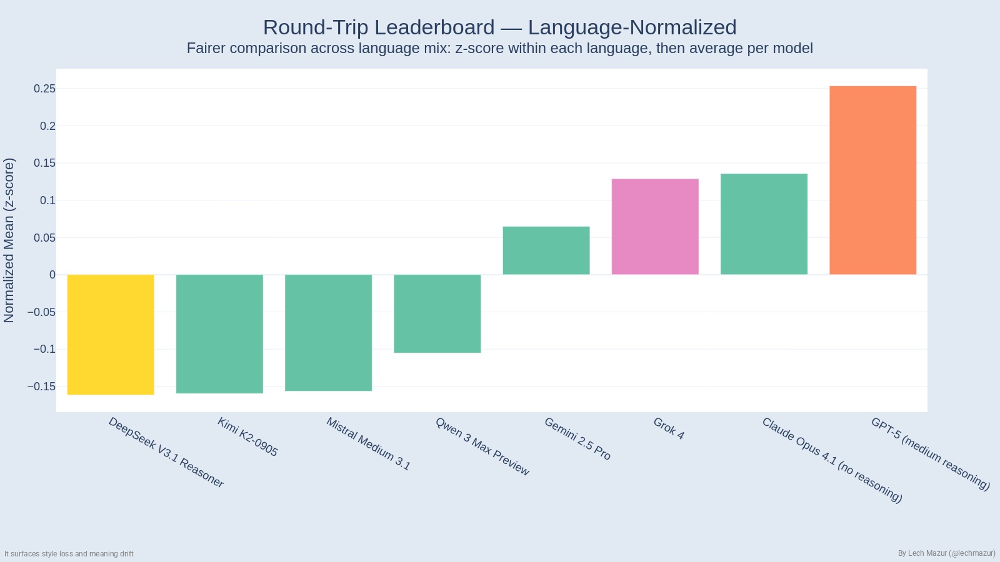
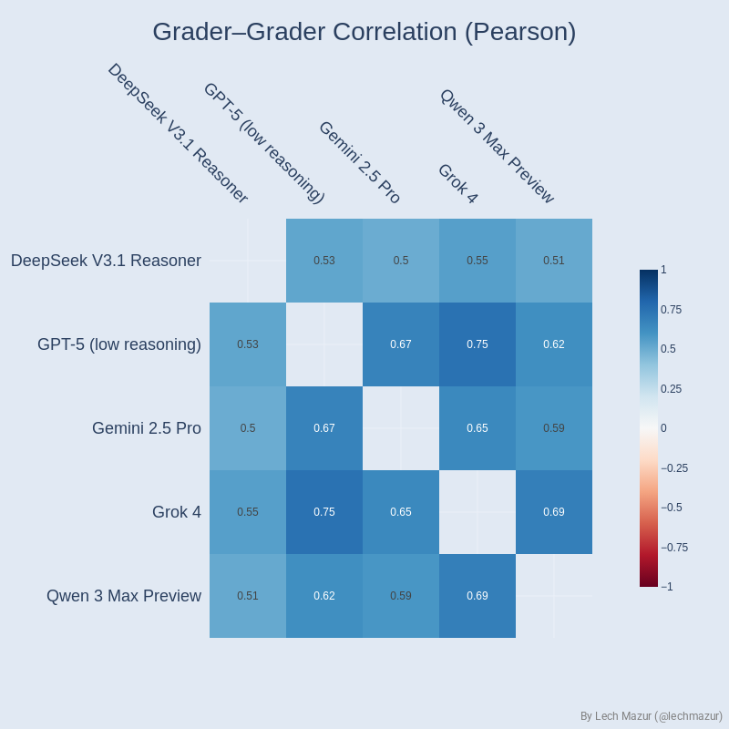
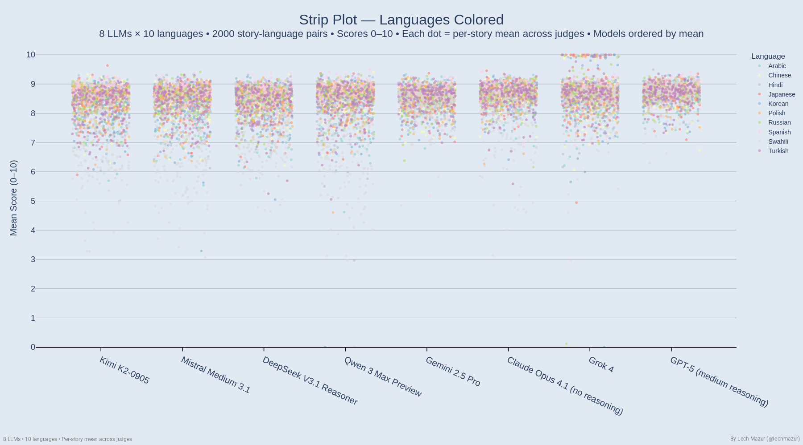

# LLM Round‑Trip Translation Benchmark

When a model translates out of English and then back to English, how much meaning and voice does it keep? Each model does both steps (English → target language → English). A judge compares the back‑translation to the original and scores closeness on a 0–10 scale.

## Key Results

The chart ranks models by average round‑trip score (higher is better). 

### Top Models (snapshot)

| Rank | Model | Mean Score |
|-----:|-------|-----------:|
| 1 | GPT-5 (medium reasoning) | 8.690 |
| 2 | Grok 4 | 8.573 |
| 3 | Claude Opus 4.1 (no reasoning) | 8.559 |
| 4 | Gemini 2.5 Pro | 8.529 |
| 5 | Qwen 3 Max Preview | 8.324 |
| 6 | DeepSeek V3.1 Reasoner | 8.298 |
| 7 | Mistral Medium 3.1 | 8.285 |
| 8 | Kimi K2-0905 | 8.285 |

## By Language

- Z-scored per language so each column shows relative strength vs. peers (0 = average for that language).
- Prefer this normalized view; it controls for language mix and difficulty.

Per‑language leaderboards (zoom) and distributions (strip plots):

  
Per‑language charts — zoomed leaderboards + strip plots (click to expand)

  
  Arabic — leaderboard (zoom) and strip plot
  
  
  
  
  
  Chinese — leaderboard (zoom) and strip plot
  
  
  
  
  
  Spanish — leaderboard (zoom) and strip plot
  
  
  
  
  
  Hindi — leaderboard (zoom) and strip plot
  
  
  
  
  
  Russian — leaderboard (zoom) and strip plot
  
  
  
  
  
  Japanese — leaderboard (zoom) and strip plot
  
  
  
  
  
  Korean — leaderboard (zoom) and strip plot
  
  
  
  
  
  Polish — leaderboard (zoom) and strip plot
  
  
  
  
  
  Turkish — leaderboard (zoom) and strip plot
  
  
  
  
  
  Swahili — leaderboard (zoom) and strip plot
  
  
  
  

### Per‑Language Leaderboards (Tables)

Full tables for each language are generated under `reports/`. See the index: `reports/leaderboard_by_language.md`.

Snapshot examples:

Spanish

| Rank | Model | Mean | Std (judges) | # Judges |
|-----:|-------|-----:|-------------:|---------:|
| 1 | GPT-5 (medium reasoning) | 8.794 | 0.434 | 5 |
| 2 | Claude Opus 4.1 (no reasoning) | 8.743 | 0.430 | 5 |
| 3 | Grok 4 | 8.680 | 0.458 | 5 |

Chinese

| Rank | Model | Mean | Std (judges) | # Judges |
|-----:|-------|-----:|-------------:|---------:|
| 1 | GPT-5 (medium reasoning) | 8.672 | 0.477 | 5 |
| 2 | Claude Opus 4.1 (no reasoning) | 8.651 | 0.468 | 5 |
| 3 | Grok 4 | 8.634 | 0.435 | 5 |

## Normalized View

Controls for language difficulty/mix by z-scoring within each language, then averaging per model.

## Reliability and Uncertainty

- Multi‑judge runs add error bars in the leaderboard and a grader‑agreement heatmap. Where judges disagree, treat small rank gaps as ties.
- We compute averages as “mean of per‑sample means,” optionally averaged across judges, so no single judge or language dominates.

Also useful for sanity‑checking graders vs. translators (normalized by grader):

## Failure Rationales

We summarize judge rationales into a lightweight taxonomy and synthesize per‑model failure models.

- Taxonomy index: `reports/error_taxonomy.md`
- Failure models (LLM‑summarized): `reports/failure_models/<translator>/<lang>.md`

Taxonomy snapshot (gpt‑5‑medium — Chinese):

| Tag | Count | Share |
|-----|------:|------:|
| tone_shift | 583 | 45.2% |
| omission | 352 | 27.3% |
| addition | 332 | 25.7% |
| numbers_units | 18 | 1.4% |
| disclaimer_meta | 5 | 0.4% |

Failure‑model excerpt (GPT‑5 — Chinese):

- Mixed‑language leakage in structured sections; headings/bullets left in Chinese in back‑translation.
- Tone/imagery flattening and metaphor drift (poetic language becomes literal; metaphor swaps).
- Domain term substitution (legal/technical terms normalized to near neighbors; scope changes).

## What’s Measured

- Round‑trip fidelity: meaning, tone/register, and stylistic alignment between original and back‑translation.
- Languages covered: Polish, Chinese, Spanish, Arabic, Hindi, Russian, Japanese, Korean, Turkish, Swahili.
- Diagnostics: distributions by language, winner share, and length ratios (back/original) to catch omissions or verbosity.

## How Scoring Works

- Judge rubric: compares original vs. back‑translation on a 0–10 scale.
- Anchors: 10.0 ≈ indistinguishable; 7.0 ≈ minor losses; 5.0 ≈ noticeable omissions/additions or tone shift; 0.0 ≈ unrelated.
- Penalties: invented/missing content, tone/register drift, meta‑disclaimers. Trivial mechanics (e.g., punctuation) don’t matter if meaning is intact.
- Aggregation: per‑item means (optionally across multiple judges), then averaged across items and languages.

## Notes

- The benchmark uses the same model for forward and back translation to stress internal consistency.
- A short narrative of findings and additional figures are available in the project’s report.

## Bonus Views

Winner distribution (overall #1 finishes across all items):

Per‑language score distributions are included above (strip plots for all languages).

Language comparison aggregates:

<!-- Top‑3 removed: biased and redundant; prefer all‑models and normalized heatmaps. -->

All‑Models Mean by Language (zoom):

Per‑language mean of per‑model means (equal weight per model). Error shading indicates uncertainty.

Strip Plot — Languages Colored:

Each dot = per‑story mean across judges; colors encode language; models on x‑axis with light jitter.

## Other multi-agent benchmarks
- [PACT - Benchmarking LLM negotiation skill in multi-round buyer-seller bargaining](https://github.com/lechmazur/pact)
- [BAZAAR - Evaluating LLMs in Economic Decision-Making within a Competitive Simulated Market](https://github.com/lechmazur/bazaar)
- [Public Goods Game (PGG) Benchmark: Contribute & Punish](https://github.com/lechmazur/pgg_bench/)
- [Elimination Game: Social Reasoning and Deception in Multi-Agent LLMs](https://github.com/lechmazur/elimination_game/)
- [Step Race: Collaboration vs. Misdirection Under Pressure](https://github.com/lechmazur/step_game/)

## Other benchmarks
- [LLM Creative Story-Writing Benchmark](https://github.com/lechmazur/writing/)
- [Extended NYT Connections](https://github.com/lechmazur/nyt-connections/)
- [LLM Thematic Generalization Benchmark](https://github.com/lechmazur/generalization/)
- [LLM Confabulation/Hallucination Benchmark](https://github.com/lechmazur/confabulations/)
- [LLM Deceptiveness and Gullibility](https://github.com/lechmazur/deception/)
- [LLM Divergent Thinking Creativity Benchmark](https://github.com/lechmazur/divergent/)
---

## Updates 
- Sep 15, 2025: Initial version.

- Follow [@lechmazur](https://x.com/LechMazur) on X for other upcoming benchmarks and more.
